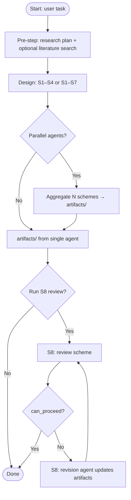

# Scheme Phase — Workflow (Agent Reference)

This document describes the **recommended workflow** for the scheme phase. When the runner is refactored into **skills** (callable by a meta-agent), the agent should use this flow as **reference**: it may skip or reorder steps when appropriate, within the constraints below.

## Flow (Mermaid)

## Constraints (guardrails)

- **End-to-end compute:** Scheme artifacts should treat **data I/O and feature pipeline** as first-class when scale is non-trivial — not only **model training** budgets. Align with **`docs/reference/ide_execution_rules.md`** (pipeline & I/O cost) and the **scheme-phase** skill verification on vectorized vs loop-heavy paths.
- **Required sequence:** Design must run at least once before S8. If parallel: Design (all agents) → Aggregate → then S8.
- **Pre-step:** Optional. Agent may skip if task is very concrete or `no_paper_search` is set.
- **S8:** Optional. If run, at least one review round; cap revision rounds (e.g. max 3) to avoid loops.
- **Design rounds:** Cap max rounds (e.g. 20 for full, 22 for S1–S7) so the design step eventually returns.
This repo does not currently implement a meta-agent that orchestrates separate scheme sub-skills; the scheme agent runs in one loop and writes the scheme package.

## Steps in words

1. **Refine** — Optionally refine the user request into a single task spec (`artifacts/refined_task.json`).
2. **Pre-research** — Optional literature retrieval (paper search), used as evidence only.
3. **Design** — Write the four required scheme artifacts under `artifacts/`.
4. **Gates & review** — Run structure/topic/quant gates; revise artifacts when gates fail.
5. **Done** — When all required artifacts exist and gates pass.

## Human review → revision entry (CLI)

To revise an existing session based on human feedback:

- Run: `python scripts/run_scheme_agent.py --revision --run-dir <scheme_session_dir> --feedback <feedback.md> --lang zh`
- Outputs (under the same session `artifacts/`): `response_to_review.md`, `revision_request.json`, `feedback_index.json`, `revision_gate.json`, `revision_meta.json`

## Skill names (for wiring)

The current runnable tools are the scheme-phase tool skills used by `core/scheme_agent.py`:

- `paper_search`
- `read_file`
- `write_file`
- `list_files`

Implementation: `core/scheme_agent.py`, `skills/scheme_phase.py`, `scripts/run_scheme_agent.py`.
